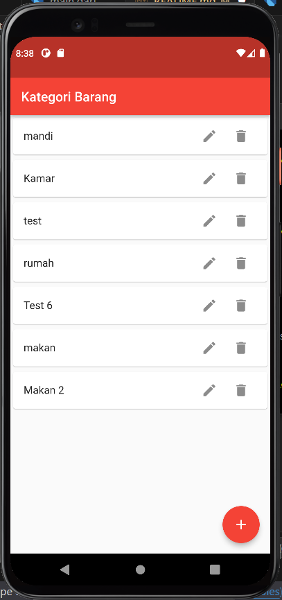
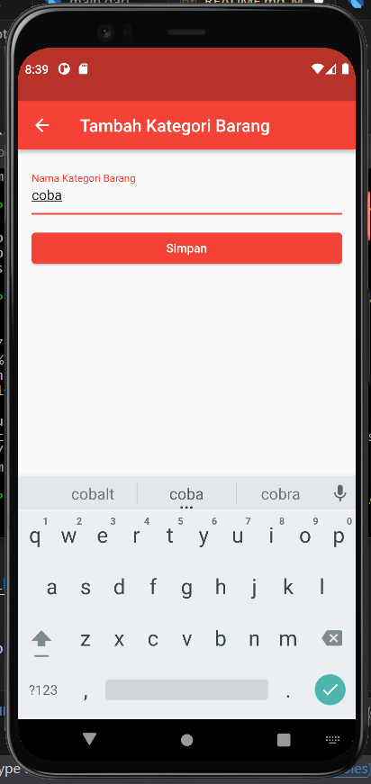
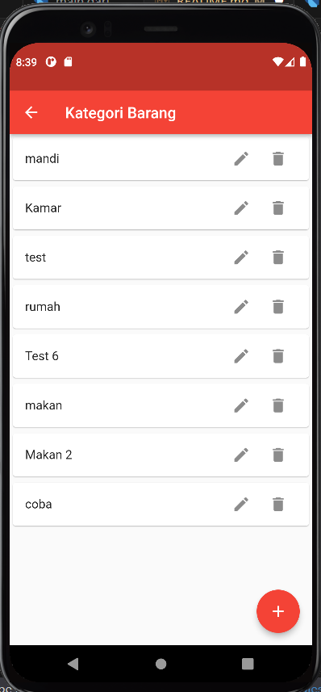
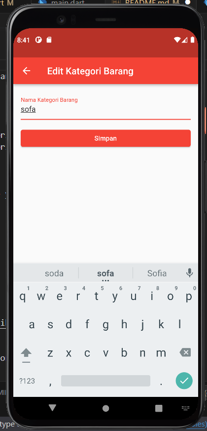
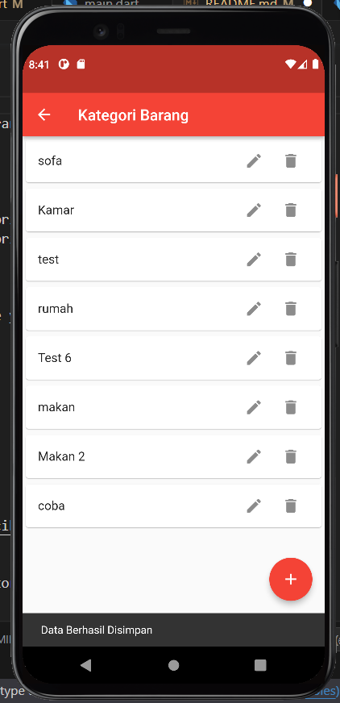
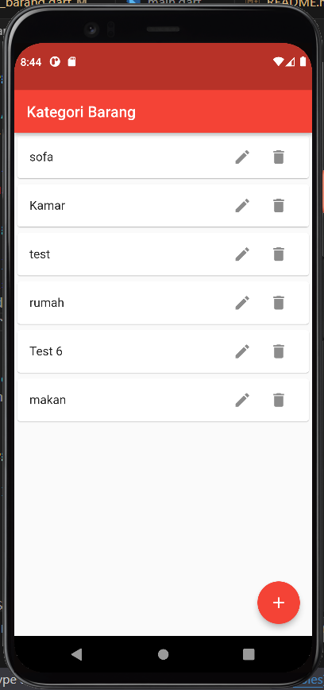

Certainly! Here's an example of how you can document your app and include it in the README file:

## My App

This is a Flutter app for managing kategori barang (category of items).

### Features

- View a list of kategori barang
- Add a new kategori barang
- Update an existing kategori barang
- Delete a kategori barang

### Screenshots

- view awal



- view add data



- data tertambah



- data edit view



- data teredit



- data terhapus


### Prerequisites

Before running the app, make sure you have the following installed:

- Flutter SDK
- Dart SDK
- Android SDK or iOS SDK

### Getting Started

1. Clone the repository:

   ```bash
   git clone https://github.com/cihuyyama/exercise_106.git
   ```

2. Navigate to the project directory:

   ```bash
   cd exercise_106
   ```

3. Install dependencies:

   ```bash
   flutter pub get
   ```

4. Run the app:

   ```bash
   flutter run
   ```

### Configuration

In the `lib/controller/kategori_barang_controller.dart` file, update the `apiUrl` variable to point to your backend API URL:

```dart
final String apiUrl = "http://localhost/api/";
```

### Usage

1. Launch the app on your device or emulator.

2. The home screen displays a list of existing kategori barang.

3. To add a new kategori barang, tap on the floating action button (`+` icon) on the bottom right. Enter the nama kategori barang and tap "Simpan" to save it.

4. To update a kategori barang, tap on the edit icon (pencil icon) next to the kategori barang entry. Make the necessary changes and tap "Simpan" to save the updates.

5. To delete a kategori barang, swipe left on the kategori barang entry and tap the delete icon (trash bin icon).

### Contributing

Contributions are welcome! If you have any suggestions, bug reports, or feature requests, please open an issue or submit a pull request.

### License

This project is licensed under the [MIT License](LICENSE).

### Acknowledgements

- [Flutter](https://flutter.dev/) - UI framework
- [http](https://pub.dev/packages/http) - HTTP client for making API requests

Feel free to customize the README file based on your specific app and requirements.